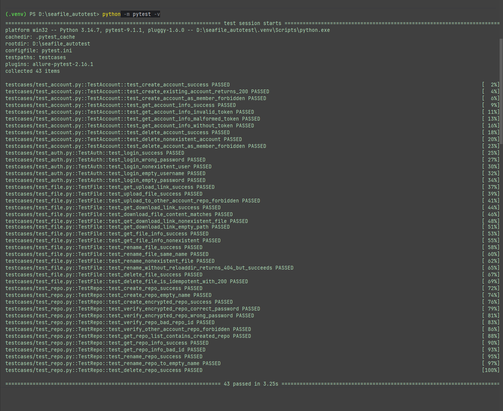

# Seafile 接口自动化测试框架

被测对象是开源私有云存储系统 **Seafile**（社区版），用 Python + Requests + Pytest + Allure 搭建。

这个项目是我转行学测试时从零搭起来的，中间踩了不少坑：限流把 403 伪装成权限错误、
删除接口返回 200 但文件根本没删、重命名不传 `reloaddir` 就报 404 可文件其实已经改名成功了。
这些坑怎么发现的、怎么定位的、最后怎么改的，都记在下面的迭代记录和 `docs/` 里。

- **用例规模**：43 条，覆盖 登录 / 账号 / 资料库 / 文件 4 个模块
- **执行耗时**：全量约 3 秒
- **执行结果**：连续 3 次全量执行 43 passed，各模块可独立执行，测试数据零残留

> 被测服务部署在内网，上面的数据来自内网环境。换一台机器直接 `pytest`
> 会因为连不上服务而整体 skip（不是失败），原因和复现方式见第九节。

---

## 一、技术栈

| 用途   | 选型                                      |
| ---- | --------------------------------------- |
| 语言   | Python 3.14                             |
| 请求库  | Requests（Session 连接复用）                  |
| 测试框架 | Pytest（Fixture 分层、标记、参数化）               |
| 报告   | Allure（feature / story / severity 三级组织） |

## 二、目录结构

```
seafile_autotest/
├─ api/                     # 接口封装层（按业务模块拆文件）
│   ├─ client.py            #   底层 HTTP 客户端：URL 拼接、Token、超时、限流重试
│   ├─ auth_api.py          #   登录 + 会话级 Token 缓存
│   ├─ account_api.py       #   账号管理
│   ├─ repo_api.py          #   资料库管理
│   └─ file_api.py          #   文件上传/下载/重命名/删除
├─ common/
│   ├─ config.py            # 环境配置（地址、账号、超时），支持环境变量覆盖
│   └─ utils.py             # 唯一测试数据生成
├─ testcases/               # 用例层，按模块拆分
│   ├─ test_auth.py         #   5 条
│   ├─ test_account.py      #  10 条
│   ├─ test_repo.py         #  13 条
│   └─ test_file.py         #  15 条
├─ data/
│   └─ sample_upload.txt    # 上传用样本文件（随项目走，换机器也能跑）
├─ docs/
│   ├─ test_report.md       # 测试报告
│   ├─ defect_report.md     # 缺陷报告
│   ├─ execution-log.txt    # 执行输出
│   └─ execution-screenshot.png
├─ .github/workflows/ci.yml # GitHub Actions 持续集成
├─ .env.example             # 环境配置模板（.env 不入库）
├─ conftest.py              # 全局 Fixture：身份、测试数据生命周期
├─ pytest.ini
├─ requirements.txt
└─ run.py                   # 一键执行 + 生成 Allure 报告
```

## 三、分层设计

```
用例层 test_*.py        只写"业务动作 + 断言"，不出现 requests、不拼 URL
   ↑
Fixture 层 conftest.py  提供身份与测试数据，管理创建 / 清理
   ↑
接口层 api/*.py         一个方法 = 一个接口，收敛路径、参数、状态码语义
   ↑
客户端层 client.py      只管 HTTP：拼 URL、带 Token、超时、限流重试
```

这样拆的好处：接口路径变了只改接口层，环境变了只改配置，新增用例可以直接复用已有的 Fixture。

## 四、快速开始

```bash
git clone https://github.com/ray-testdev/seafile-autotest.git
cd seafile_autotest
pip install -r requirements.txt

# 1) 配置被测环境：复制模板并填入实际地址与账号
cp .env.example .env        # Windows: copy .env.example .env

# 2) 执行
pytest                       # 全量执行
pytest -m defect             # 只跑"锁定疑似缺陷行为"的用例
pytest -m "not defect"       # 跳过缺陷锁定用例
python run.py                # 执行并生成 Allure 报告
```

配置读取优先级：**环境变量 > 项目根目录 .env**。CI 中通过 Secret 注入，
本地通过 `.env` 注入，两者都不写死在代码里 —— 仓库因此可以安全公开。

## 五、持续集成

`.github/workflows/ci.yml` 定义了两个作业：

| 作业   | 触发条件         | 内容                                    |
| ---- | ------------ | ------------------------------------- |
| 静态检查 | 每次 push / PR | 语法编译 + `pytest --collect-only` 用例收集校验 |
| 接口测试 | 手动触发         | 全量执行并上传 Allure 结果                     |

静态检查里的"用例收集校验"是为了挡住模块导入错误：配置里删掉一个常量、
测试文件还在 import 它，pytest 就一条用例都收集不到。这个问题在本地要等到手动执行
才会发现，放进 CI 之后每次提交立刻暴露。

接口测试作业需要连内网服务，所以用 Secret 注入环境变量之后才触发。

## 六、迭代记录

这个框架不是一次写成的，前后迭代了五个版本：

| 版本  | 做法                                                                                                 | 暴露的问题                                                                                    |
| --- | -------------------------------------------------------------------------------------------------- | ---------------------------------------------------------------------------------------- |
| v0  | 沿用 Postman 的思路组织用例：前一条用例把 `repo_id`、token 存起来交给后面的用例用（试过实例属性、局部变量、全局变量）                             | pytest 会为**每条用例新建一个测试类实例**，上一条存的值到下一条里就不存在了 —— **不是顺序问题，怎么排都传不过去**。只有最前面几条不需要前置数据的用例能跑通，后面的一律失败 |
| v1  | 面向对象 + `setup_method` / `teardown_method`，所有用例共用一组固定的管理员/普通账号                                      | **单文件执行正常，全量执行必挂**：账号被反复创建删除，前一条用例改动的状态会影响后续用例                                           |
| v2  | 改用 Pytest Fixture 分层：管理员/普通账号类级共享，临时账号函数级创建与销毁                                                     | 清理逻辑仍散落在用例里；文件类用例的"取上传链接 → 上传 → 拼路径"重复了十几遍                                               |
| v3  | 补齐 Fixture 链（账号 → 资料库 → 文件），全量用例跑通                                                                 | 仍然只断言状态码；请求无超时；凭据硬编码；唯一数据依赖"时间戳 + 随机数"，存在碰撞概率                                            |
| v4  | 工程化重构：拆分 api 层与配置层；请求统一加超时；引入会话级 Token 缓存与 429 退避重试；断言从"只看状态码"升级为"创建后回查、删除后回查、下载后逐字节比对"；清理策略改为整库删除 | 当前版本                                                                                     |

v0 → v2 这两轮解决的是同一个根本问题：**消除用例之间的隐式依赖**。

v0 依赖执行顺序传递数据，v1 依赖共享账号承载状态，两种做法都会让用例无法单独执行，
且失败会连锁扩散。最终方案是把"前置数据"的创建与销毁整体交给 Fixture，
用例只声明自己需要什么，不关心它从哪来。

## 七、几个关键设计点

### 1. Fixture 分层管理测试数据生命周期

| Fixture                                    | 作用域      | 说明                   |
| ------------------------------------------ | -------- | -------------------- |
| `admin_client` / `member_client`           | session  | 管理员 / 普通成员身份，全会话登录一次 |
| `shared_user_client`                       | session  | 资源类用例共用的测试账号         |
| `disposable_account` / `disposable_client` | function | 一次性账号，给账号模块用例        |
| `repo` / `encrypted_repo`                  | function | 每条用例一个独立资料库，结束时整库删除  |
| `uploaded_file`                            | function | 资料库中预先上传一个文件         |

清理动作一律写在 `yield` 之后，用例失败时也会执行。

**多个 Fixture 的执行顺序是"层层包裹"的**：按声明顺序依次执行每个 Fixture 的
`yield` 前半段，逐层把数据交给用例；用例结束后，再按**相反顺序**执行后半段。

```
建临时账号 → 建资料库 → 传文件 → 【执行用例】 → 删文件 → 删资料库 → 删临时账号
```

先建的最后拆，所以无论用例成功还是失败，环境都能完整还原。

### 2. 认证接口有限流，登录必须复用

`/api2/auth-token/` 有频率限制，实测连续约 15 次请求就会触发。每条用例建账号再登录的写法，
一次全量要打 30 多次登录请求，第二次执行就被限流拦住，报出来的却是
`403 Authentication credentials were not provided.` —— 看起来像权限问题，极难定位。

处理方式：资源类用例共用一个会话级账号（隔离性由"每条用例一个独立资料库"保证）；
`AuthApi` 加会话级 Token 缓存；客户端识别 `429` 并按服务端提示的时长重试。
登录次数从 30+ 降到 3。

### 3. 断言不能只看状态码

- 创建后回查：确认名字、`encrypted` 标志、`permission` 都正确；
- 删除后回查：再查一次必须返回 404；
- 越权失败后回查：确认目标资源没有被改动；
- 下载后逐字节比对：`r.content == 本地文件字节`，端到端验证文件完整性。

## 八、测试结论

| 模块     | 用例数    | 结果                |
| ------ | ------ | ----------------- |
| 登录     | 5      | 全部通过              |
| 账号     | 10     | 全部通过              |
| 资料库    | 13     | 全部通过（含 1 条缺陷锁定用例） |
| 文件     | 15     | 全部通过（含 3 条缺陷锁定用例） |
| **合计** | **43** | **43 passed**     |

**通过率 100%**，连续 3 轮全量执行稳定通过，各模块可独立执行，测试数据零残留。

测试过程中发现 4 处疑似服务端缺陷 / 接口设计不一致：

- [`docs/test_report.md`](docs/test_report.md) —— 测试报告（范围、环境、执行统计、结论）
- [`docs/defect_report.md`](docs/defect_report.md) —— 缺陷报告（复现步骤、影响分析、修复建议）

### 为什么"发现了缺陷"却还是全部通过？

4 个缺陷用例用 `@pytest.mark.defect` 标记，断言的是**服务端当前的实际行为**——
也就是缺陷行为本身，所以它们是绿的。一旦服务端把缺陷修掉，这些用例会失败，
用来提醒回来复核并关闭缺陷单。

只看正常功能、跳过缺陷锁定用例：

```bash
pytest -m "not defect"
```

## 九、运行环境

这套用例需要一个**可达的 Seafile 实例**，直接 clone 下来跑不通：

- 被测服务是学习期间部署在**内网**的 Seafile 社区版，公网无法访问；如果要在外网跑，
  需要另外准备一个可达的实例；
- 当地址不可达时，`pytest` 会把全部用例标记为 **skipped 并说明原因**，避免被当成用例失败。

执行结果：



完整输出见 [`docs/execution-log.txt`](docs/execution-log.txt)。

复现方式（在能访问被测服务的机器上执行）：

```powershell
cd seafile_autotest
python -m pytest -v 2>&1 | Out-File -Encoding utf8 docs\execution-log.txt
```
